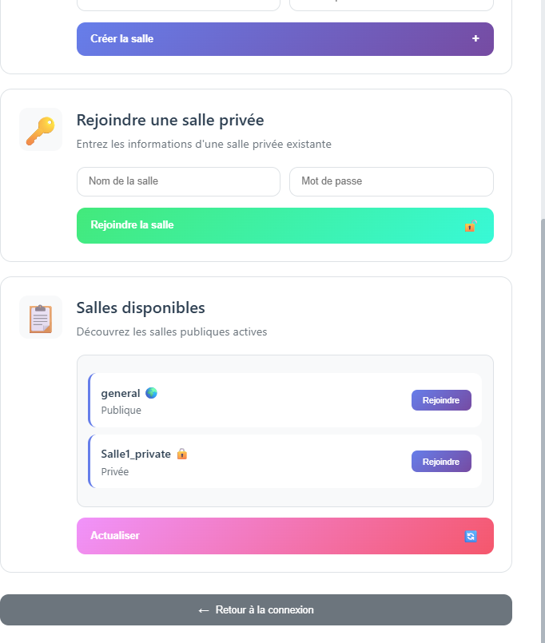
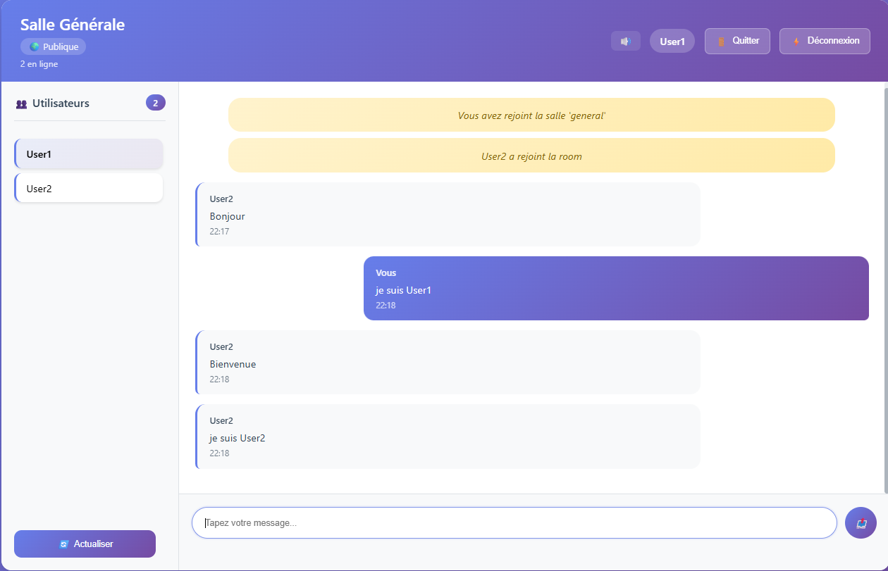
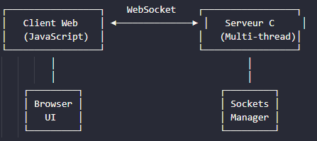
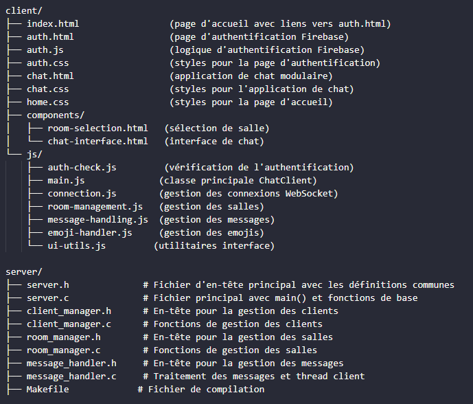

# 🚀 ChatHub - Application de Chat en Temps Réel

ChatHub est une application de chat moderne et complète permettant la communication en temps réel avec support des salles publiques et privées. Le projet comprend un serveur C robuste et une interface web responsive.






## 📋 Table des Matières

- [Fonctionnalités](#-fonctionnalités)
- [Architecture](#-architecture)
- [Prérequis](#-prérequis)
- [Installation](#-installation)
- [Configuration](#-configuration)
- [Utilisation](#-utilisation)
- [Structure du Projet](#-structure-du-projet)
- [API et Protocoles](#-api-et-protocoles)
- [Développement](#-développement)
- [Dépannage](#-dépannage)
- [Contribution](#-contribution)
- [Licence](#-licence)


## ✨ Fonctionnalités

- ✅ Serveur robuste en C utilisant la programmation système
- ✅ Client web responsive avec interface moderne
- ✅ Connexion avec pseudonyme unique
- ✅ Liste des utilisateurs connectés en temps réel
- ✅ Échange de messages instantané
- ✅ Notifications de connexion/déconnexion
- ✅ Reconnexion automatique en cas de perte de connexion
- ✅ Indicateur de frappe (qui est en train d'écrire)
- ✅ Sons de notification pour les messages


### 🌟 Fonctionnalités Principales

- **Chat en temps réel** : Communication instantanée entre utilisateurs
- **Salles publiques** : Accès libre pour tous les utilisateurs
- **Salles privées** : Salles sécurisées par mot de passe
- **Interface moderne** : Design responsive et intuitive
- **Gestion des utilisateurs** : Liste des utilisateurs connectés en temps réel
- **Notifications sonores** : Sons personnalisables pour les messages
- **Reconnexion automatique** : Gestion intelligente des déconnexions

### 🔧 Fonctionnalités Techniques

- **Serveur C haute performance** : Gestion multi-thread des connexions
- **WebSocket** : Communication bidirectionnelle en temps réel
- **Sécurité** : Validation des entrées et gestion des erreurs
- **Scalabilité** : Support jusqu'à 100 clients simultanés
- **Cross-platform** : Compatible Windows, Linux, macOS


## 🏗️ Architecture

.png>)





### Composants

1. **Serveur C** (`server.c`)
   - Gestion des connexions WebSocket
   - Routage des messages
   - Gestion des salles et utilisateurs
   - Thread pool pour les performances

2. **Client Web** (`script.js`)
   - Interface utilisateur interactive
   - Gestion des états de connexion
   - Communication WebSocket
   - Notifications et sons

3. **Interface** (`index.html` + `style.css`)
   - Design responsive moderne
   - Écrans de connexion et sélection de salle
   - Interface de chat intuitive


## 📋 Prérequis

### Système d'Exploitation
- **Windows** : Windows 10/11 (recommandé)
- **Linux** : Ubuntu 18.04+ ou équivalent
- **macOS** : macOS 10.14+

### Outils de Développement
- **Compilateur C** : GCC 7.0+ ou MSVC 2019+
- **Navigateur Web** : Chrome 80+, Firefox 75+, Safari 13+
- **Proxy WebSocket** : Node.js 14+ (pour le développement)

### Bibliothèques
- **Windows** : Winsock2 (inclus dans Windows SDK)
- **Linux/macOS** : pthread, socket (généralement inclus)

### Pour le serveur C
- Windows (testé sur Windows 11)
- MinGW-w64 (GCC pour Windows)
- Make (optionnel)

### Pour le proxy WebSocket
- Node.js (v14.0.0 ou supérieur)
- npm

### Pour le client web
- Navigateur web moderne (Chrome, Firefox, Edge, Safari)

## Installation

### 1. Cloner le dépôt
git clone https://github.com/Oumaima-Lg/ChatHub.git
cd chat-application


### Compiler le serveur C

### Avec Makefile (recommandé)
```bash
# Compiler le projet
make

# Nettoyer les fichiers objets
make clean

# Recompiler complètement
make rebuild

# Compiler et exécuter
make run
```

### Compilation manuelle
```bash
# Créer le dossier obj
mkdir obj

# Compiler les fichiers objets
gcc -Wall -Wextra -std=c99 -c server.c -o obj/server.o
gcc -Wall -Wextra -std=c99 -c client_manager.c -o obj/client_manager.o
gcc -Wall -Wextra -std=c99 -c room_manager.c -o obj/room_manager.o
gcc -Wall -Wextra -std=c99 -c message_handler.c -o obj/message_handler.o

# Lier les fichiers objets
gcc obj/server.o obj/client_manager.o obj/room_manager.o obj/message_handler.o -o server -lws2_32
```


### 3. Installer les dépendances du proxy WebSocket

cd server
npm install


## Utilisation

### 1. Démarrer le serveur C

cd server
./server 

ou
./server.exe

Le serveur démarre sur le port 8080 par défaut.

### 2. Démarrer le proxy WebSocket

Dans un autre terminal :

cd server
node websocket-proxy.js


### 3. Ouvrir le client web

Ouvrez le fichier `client/index.html` dans votre navigateur.

Ou utilisez un serveur web local :

cd client
python -m http.server 8000

ou
npx live-server


Puis accédez à `http://localhost:8000` dans votre navigateur.

### 4. Se connecter au chat

- Entrez votre pseudonyme
- Assurez-vous que l'adresse du serveur est correcte (par défaut: `localhost:3000`)
- Cliquez sur "Se connecter"


### Guide d'Utilisation de l'application

#### 1. Connexion
- Entrer un pseudonyme unique (max 20 caractères)
- Configurer l'adresse du serveur si nécessaire
- Activer/désactiver les notifications sonores
- Cliquer sur "Se connecter"

#### 2. Sélection de Salle
- **Salle publique** : Accès libre, visible par tous
- **Créer salle privée** : Définir nom et mot de passe
- **Rejoindre salle privée** : Entrer nom et mot de passe
- **Liste des salles** : Voir les salles disponibles

#### 3. Chat
- Taper des messages (max 500 caractères)
- Voir la liste des utilisateurs connectés
- Utiliser le bouton "Actualiser" pour mettre à jour
- Quitter la salle ou se déconnecter


## Structure du projet



<!-- client/
├── index.html                 (page d'accueil avec liens vers auth.html)
├── auth.html                  (page d'authentification Firebase)
├── auth.js                    (logique d'authentification Firebase)
├── auth.css                   (styles pour la page d'authentification)
├── chat.html                  (application de chat modulaire)
├── chat.css                   (styles pour l'application de chat)
├── home.css                   (styles pour la page d'accueil)
├── components/
│   ├── room-selection.html   (sélection de salle)
│   └── chat-interface.html   (interface de chat)
└── js/
    ├── auth-check.js         (vérification de l'authentification)
    ├── main.js              (classe principale ChatClient)
    ├── connection.js        (gestion des connexions WebSocket)
    ├── room-management.js   (gestion des salles)
    ├── message-handling.js  (gestion des messages)
    ├── emoji-handler.js     (gestion des emojis)
    └── ui-utils.js         (utilitaires interface)

server/
├── server.h              # Fichier d'en-tête principal avec les définitions communes
├── server.c              # Fichier principal avec main() et fonctions de base
├── client_manager.h      # En-tête pour la gestion des clients
├── client_manager.c      # Fonctions de gestion des clients
├── room_manager.h        # En-tête pour la gestion des salles
├── room_manager.c        # Fonctions de gestion des salles
├── message_handler.h     # En-tête pour la gestion des messages
├── message_handler.c     # Traitement des messages et thread client
├── Makefile             # Fichier de compilation -->


## Fonctionnement technique

### Architecture

L'application utilise une architecture client-serveur avec trois composants principaux :

1. **Serveur C** : Gère les connexions TCP, les clients et la diffusion des messages
2. **Proxy WebSocket** : Convertit les connexions WebSocket du navigateur en connexions TCP pour le serveur C
3. **Client Web** : Interface utilisateur en HTML/CSS/JavaScript qui se connecte au proxy WebSocket


## Modules

### 1. server.h / server.c
- **Rôle** : Fichier principal contenant la fonction `main()` et les fonctions de base du serveur
- **Contient** :
  - Variables globales (clients, rooms, mutexes)
  - Fonction `main()` avec la boucle d'acceptation des connexions
  - Fonctions `cleanup_server()` et `console_handler()`
  - Initialisation du serveur et gestion des connexions

### 2. client_manager.h / client_manager.c
- **Rôle** : Gestion des clients connectés
- **Contient** :
  - `add_client()` : Ajouter un client à la liste
  - `remove_client()` : Supprimer un client de la liste
  - `broadcast_message()` : Diffuser un message à tous les clients
  - `send_client_list()` : Envoyer la liste des clients connectés

### 3. room_manager.h / room_manager.c
- **Rôle** : Gestion des salles de chat
- **Contient** :
  - `init_rooms()` : Initialiser les salles (créer la salle "general")
  - `find_room_by_name()` : Trouver une salle par son nom
  - `create_room()` : Créer une nouvelle salle
  - `join_room()` : Faire rejoindre un client à une salle
  - `leave_room()` : Faire quitter un client d'une salle
  - `broadcast_to_room()` : Diffuser un message dans une salle
  - `send_room_list()` : Envoyer la liste des salles
  - `send_room_users()` : Envoyer la liste des utilisateurs d'une salle
  - `send_room_message()` : Envoyer un message formaté dans une salle
  - `handle_leave_room()` : Gérer la sortie d'une salle

### 4. message_handler.h / message_handler.c
- **Rôle** : Traitement des messages et gestion des threads clients
- **Contient** :
  - `handle_client()` : Thread principal pour gérer chaque client
  - Traitement de tous les types de messages (LIST, ROOMS, CREATE_ROOM, JOIN_ROOM, etc.)
  - Logique de communication avec les clients
  

## 🔌 API et Protocoles

### Messages Client → Serveur

| Commande | Format | Description |
|----------|--------|-------------|
| Connexion | `username` | Connexion avec pseudonyme |
| Liste utilisateurs | `LIST` | Demander la liste des utilisateurs |
| Liste salles | `ROOMS` | Demander la liste des salles |
| Créer salle | `CREATE_ROOM:nom:password` | Créer une nouvelle salle |
| Rejoindre salle | `JOIN_ROOM:nom:password` | Rejoindre une salle |
| Quitter salle | `LEAVE_ROOM:nom` | Quitter une salle |
| Message salle | `ROOM_MSG:salle:message` | Envoyer un message |
| Utilisateurs salle | `ROOM_USERS:salle` | Liste des utilisateurs d'une salle |

### Messages Serveur → Client

| Type | Format | Description |
|------|--------|-------------|
| Liste clients | `CLIENTS:user1,user2,...` | Liste des utilisateurs |
| Liste salles | `ROOMS:room1,room2(private),...` | Liste des salles |
| Salle créée | `ROOM_CREATED:nom` | Confirmation de création |
| Salle rejointe | `ROOM_JOINED:nom` | Confirmation d'entrée |
| Salle quittée | `ROOM_LEFT:nom` | Confirmation de sortie |
| Message | `ROOM_MSG:salle:user:message` | Message reçu |
| Utilisateurs salle | `ROOM_USERS:salle:user1,user2` | Utilisateurs d'une salle |
| Système | `SYSTEM:message` | Message système |
| Erreur | `ERROR:message` | Message d'erreur |


## Dépannage

### Le serveur ne démarre pas

- Vérifiez que le port 8080 n'est pas déjà utilisé
- Assurez-vous que les bibliothèques Winsock sont disponibles


### Impossible de se connecter au serveur

- Vérifiez que le serveur C est en cours d'exécution
- Vérifiez que le proxy WebSocket est en cours d'exécution
- Assurez-vous que l'adresse du serveur est correcte


### Les messages ne s'affichent pas

- Vérifiez la console du navigateur pour les erreurs
- Assurez-vous que la connexion WebSocket est établie


## Améliorations possibles

- Chiffrement des communications
- Authentification des utilisateurs
- Partage de fichiers
- Historique des messages
- Interface administrateur
- Support des emojis et du formatage de texte
- Version mobile native


## Licence

Ce projet est sous licence MIT. Voir le fichier `LICENSE` pour plus de détails.

## Auteur

OIO

---

**ChatHub** - Connecter les gens, une conversation à la fois. 💬✨


